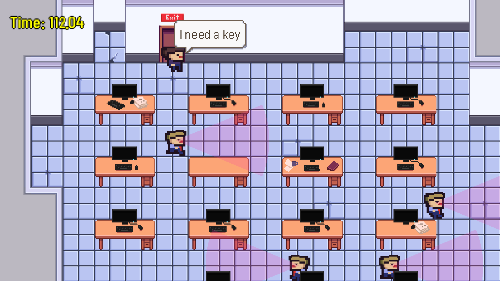

Crunch Escape
=============

Source code for a Ludum Dare 47 entry.

Theme: *stuck in a loop*.

[Official submission](https://ldjam.com/events/ludum-dare/47/crunch-escape) +
[itch.io](https://killy9999.itch.io/crunch-escape) (contains an embedded HTML5
version as well as Windows, Linux, and Mac builds).

**Welcome back, Employee!**

  * Your CorpCorp login: user34237438
  * Your productivity level %, last week average: 60%

**WARNING:** You risk working overtime! Please adjust your productivity level!

Rules
=====

Your corporate project is falling behind schedule, so the management introduced
a six-day working week.  But who wants to stay in the office on Saturdays?  Your
task is to get out of your office without the managers noticing.  Every time
they catch you they will send you back to your desk and you have to start over.
The exit door are locked and the key is placed on a desk at the other side of
the office.  Collect the key and escape through the exit door.  Navigate your
character using arrows or D-pad on a controller.  Use space bar or controller A
button to:

  * sit at the nearby desk and pretend that you're working.  This will cause
    managers to ignore you.

  * pick up the key from a desk

  * open the door once you have the key

Controls
========

  * **Move:** Arrows / D-pad (on a controller)
  * **Interact:** Space / A (on a controller)
  * **Quit:** press Esc twice

Scoring
=======

Get out of the office as quickly as possible.  Escape time is your score - the
lower the better.

Building from source
====================

Written in [Haxe](https://haxe.org/) using [heaps.io](https://heaps.io/) engine.
To compile and run the game you need a working installation of Haxe 4.1.x and
[Hashlink](https://hashlink.haxe.org).  Heaps library is included as submodules
in the repo.  On Linux run `./init.sh` script after checkout to update the
submodules, create a local `haxelib` sandbox, and install the required libraries
into the sandbox.  Alternatively you can do this manually by running the
commands from the `init.sh` script.

The following build targets are available:

  * SDL development build (Linux or Windows platforms via hashlink target):
    compile and run with `make devel.hl`.  Run with `make run.hl`

  * JavaScript development build (any modern web browser): compile with `make
    devel.js`, run with `make run.js` or by opening `index.html` in a web
    browser.

On Linux you can create release builds for Linux, Windows, and HTML5 by running
`make release`.

Screenshots
===========

Known bugs
==========

We're not aware of any major bugs but there's an important quality-of-life
feature missing.  Once you complete the game it doesn't restart, which means you
have to either close the program (for standalone executable) and run it again or
reload the web page (for HTML5 version).

Credits
=======

  * Programming: killy9999, spacePotato, Waev, silnar
  * Graphics: spacePotato, Waev
  * Sound: Waev
